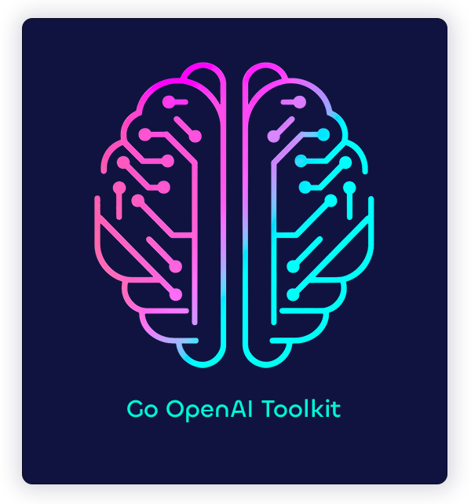

<a name="readme-top"></a>
<!-- PROJECT SHIELDS -->
<!--
*** I'm using markdown "reference style" links for readability.
*** Reference links are enclosed in brackets [ ] instead of parentheses ( ).
*** See the bottom of this document for the declaration of the reference variables
*** for contributors-url, forks-url, etc. This is an optional, concise syntax you may use.
*** https://www.markdownguide.org/basic-syntax/#reference-style-links
-->


<div align="center">

[![Contributors][contributors-shield]][contributors-url]
[![Forks][forks-shield]][forks-url]
[![Stargazers][stars-shield]][stars-url]
[![Issues][issues-shield]][issues-url]
[![MIT License][license-shield]][license-url]

</div>

<!-- PROJECT LOGO -->
<br />
<div align="center">
  <a href="https://github.com/emilkje/go-openai-toolkit">
    
  </a>

<h3 align="center">Go OpenAI Toolkit</h3>

  <p align="center">
    Power your OpenAI assistant with custom tools!
    <br />
    <a href="https://github.com/emilkje/go-openai-toolkit"><strong>Explore the docs »</strong></a>
    <br />
    <br />
    <a href="https://github.com/emilkje/go-openai-toolkit">View Demo</a>
    ·
    <a href="https://github.com/emilkje/go-openai-toolkit/issues">Report Bug</a>
    ·
    <a href="https://github.com/emilkje/go-openai-toolkit/issues">Request Feature</a>
  </p>
</div>


<!-- TABLE OF CONTENTS -->
<details>
  <summary>Table of Contents</summary>
  <ol>
    <li>
      <a href="#about-the-project">About The Project</a>
      <ul>
        <li><a href="#built-with">Built With</a></li>
      </ul>
    </li>
    <li>
      <a href="#getting-started">Getting Started</a>
      <ul>
        <li><a href="#prerequisites">Prerequisites</a></li>
        <li><a href="#installation">Installation</a></li>
      </ul>
    </li>
    <li><a href="#usage">Usage</a></li>
    <li><a href="#roadmap">Roadmap</a></li>
    <li><a href="#contributing">Contributing</a></li>
    <li><a href="#license">License</a></li>
    <li><a href="#contact">Contact</a></li>
    <li><a href="#acknowledgments">Acknowledgments</a></li>
  </ol>
</details>


<!-- ABOUT THE PROJECT -->
## About The Project

[![Product Name Screen Shot][product-screenshot]](https://github.com/emilkje/go-openai-toolkit)

The [sashabaranov/go-openai](https://github.com/sashabaranov/go-openai) library is a great starting point for creating your first OpenAI project. However, it lacks a lot of the tools and features that are necessary to get started with a proper agent.

This project aims to provide a toolkit for developers to get started with creating their own OpenAI assistants powered by their own custom tools. The toolkit includes a variety of features such as:

* **Code Generator**: Create dead simple tool structs and let the code generator generate the OpenAI function specs
* **Runtime**: A runtime that will handle the conversation loop and call the appropriate tools
* **go-openai integration**: Compatible with messages from go-openai library

Of course, this is just the beginning. I hope to add more features and built-in tools to the toolkit as time goes on.
See <a href="#roadmap">the roadmap</a> for more information.

<p align="right">(<a href="#readme-top">back to top</a>)</p>


### Built With

This project is intentionally built with a minimal set of dependencies, but it relies heavily on the following pieces of tech:

* [![Go][Go]][Go-url]
* [sashabaranov/go-openai][go-openai-url]

<p align="right">(<a href="#readme-top">back to top</a>)</p>


<!-- GETTING STARTED -->
## Getting Started

To get started with the Go OpenAI Toolkit, you will need to install the go language. You can find the installation instructions [here](https://go.dev/doc/install).

### Prerequisites

This project requires no external prerequisites other than the Go language itself.

### Installation

1. The code generator is strictly optional, but it is recommended to use it to generate the tool definitions. You can install it by running the following command:

      ```sh
      go install github.com/emilkje/go-openai-toolkit/cmd/toolkit-tools-gen@latest
      ```

2. Add the toolkit to your project

    ```sh
    go get -u github.com/emilkje/go-openai-toolkit
    ```

<p align="right">(<a href="#readme-top">back to top</a>)</p>


<!-- USAGE EXAMPLES -->
## Usage

1. Create a new tool in the directory of your choice, here `./tools/weather.go` is used as an example

    ```golang
    package tools
    
    import (
        "fmt"
        "github.com/emilkje/go-openai-toolkit/toolkit"
    )
    
    type WeatherToolArgs struct {
        Location string `json:"location" desc:"The location to get the weather for."`
    }
    
    // WeatherTool is a tool that greets a person
    // +tool:name=weather_tool
    // +tool:description=WeatherTool reports the current weather for a location
    type WeatherTool struct {
        toolkit.Tool[WeatherToolArgs]
    }
    
    func (g *WeatherTool) Execute() string {
        location := g.GetArguments().Location
        return fmt.Sprintf("It's sunny with a temperature of 21C in %s", location)
    }

    ```

2. Generate the tool specs

    ```sh
    toolkit-tools-gen -path ./tools
    ```
   or use the go generate directive in your main file

    ```golang
    //go:generate toolkit-tools-gen -path ./tools
    ```

   and run `go generate ./...` in the root of your project

3. Register the tool in a toolkit and kick off the runtime

    ```golang
    package main
    
    import (
        toolkit_runtime "github.com/emilkje/go-openai-toolkit/runtime"
        "github.com/emilkje/go-openai-toolkit/toolkit"
        "github.com/emilkje/go-openai-toolkit/tools"
        "github.com/sashabaranov/go-openai"
    )
    
    func main() {
        // The toolkit holds a collection of tools
        tk := toolkit.NewToolkit()
        // Register your tool with the toolkit
        tk.RegisterTool(tools.NewWeatherTool())
    
        // client setup is omitted for brevity
        client := openai.NewClientWithConfig(newConfigFromEnv())
   
        // Initialize the runtime with the client and toolkit
        runtime := toolkit_runtime.NewRuntime(client, tk)
    
        messages := []openai.ChatCompletionMessage{
            {
                Role:    openai.ChatMessageRoleSystem,
                Content: "You are a helpful assistant",
            },
            {
                Role:    openai.ChatMessageRoleUser,
                Content: "What is the weather in Oslo?",
            },
        }
    
        // The runtime handles the conversation and tool-calling loop
        chatLog, err := runtime.ProcessChat(messages)
    }
    ```

   > **Note**: To see a full example, check out the [example](./example) directory.

<p align="right">(<a href="#readme-top">back to top</a>)</p>


<!-- ROADMAP -->
<a name="roadmap"></a>
## Roadmap

- [x] Create a basic toolkit
- [x] Code generator for tools
- [x] Runtime for handling the conversation loop
- [ ] Provide a streaming interface for the runtime 
- [ ] Add Changelog

See the [open issues](https://github.com/emilkje/go-openai-toolkit/issues) for a full list of proposed features (and known issues).

<p align="right">(<a href="#readme-top">back to top</a>)</p>


<!-- CONTRIBUTING -->
## Contributing

Contributions are what make the open source community such an amazing place to learn, inspire, and create. Any contributions you make are **greatly appreciated**.

If you have a suggestion that would make this better, please fork the repo and create a pull request. You can also simply open an issue with the tag "enhancement".
Don't forget to give the project a star! Thanks again!

1. Fork the Project
2. Create your Feature Branch (`git checkout -b feature/AmazingFeature`)
3. Commit your Changes (`git commit -m 'add some AmazingFeature'`)
4. Push to the Branch (`git push origin feature/AmazingFeature`)
5. Open a Pull Request

<p align="right">(<a href="#readme-top">back to top</a>)</p>


<!-- LICENSE -->
## License

Distributed under the MIT License. See [LICENSE](./LICENSE) for more information.

<p align="right">(<a href="#readme-top">back to top</a>)</p>


<!-- ACKNOWLEDGMENTS -->
## Acknowledgments

This would have been much harder to create without the following projects:

* [sashabaranov/go-openai][go-openai-url]

<p align="right">(<a href="#readme-top">back to top</a>)</p>


<!-- MARKDOWN LINKS & IMAGES -->
<!-- https://www.markdownguide.org/basic-syntax/#reference-style-links -->
[contributors-shield]: https://img.shields.io/github/contributors/emilkje/go-openai-toolkit.svg?style=for-the-badge
[contributors-url]: https://github.com/emilkje/go-openai-toolkit/graphs/contributors
[forks-shield]: https://img.shields.io/github/forks/emilkje/go-openai-toolkit.svg?style=for-the-badge
[forks-url]: https://github.com/emilkje/go-openai-toolkit/network/members
[stars-shield]: https://img.shields.io/github/stars/emilkje/go-openai-toolkit.svg?style=for-the-badge
[stars-url]: https://github.com/emilkje/go-openai-toolkit/stargazers
[issues-shield]: https://img.shields.io/github/issues/emilkje/go-openai-toolkit.svg?style=for-the-badge
[issues-url]: https://github.com/emilkje/go-openai-toolkit/issues
[license-shield]: https://img.shields.io/github/license/emilkje/go-openai-toolkit.svg?style=for-the-badge
[license-url]: https://github.com/emilkje/go-openai-toolkit/blob/master/LICENSE.txt
[product-screenshot]: docs/assets/tool_example.png
[Go]: https://img.shields.io/github/go-mod/go-version/emilkje/go-openai-toolkit?style=for-the-badge
[Go-url]: https://go.dev/
[go-openai-url]: https://github.com/sashabaranov/go-openai