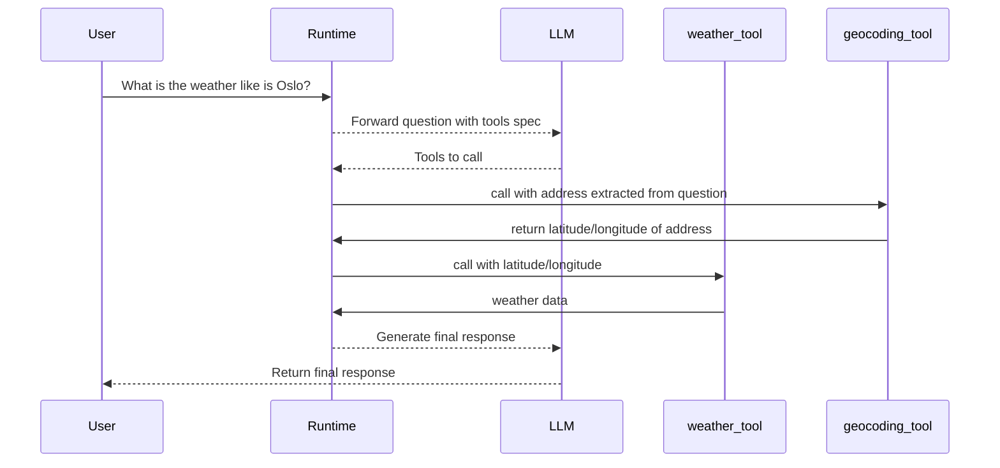

# Weather Forecast Example

This example helps you understand how to use the [Go OpenAI Toolkit][go-openai-toolkit-url] for creating and utilizing tools to respond to user requests effectively.

## Overview of Tools

- **Geocoding Tool**: Transforms an address into geographical coordinates (latitude and longitude).
- **Weather Tool**: Provides the current weather conditions for a specific set of geographical coordinates.

By combining these tools, the system can handle complex requests. For example, if someone wants to know the weather at a certain address, the system first converts the address to coordinates using the Geocoding Tool, then fetches the weather for those coordinates with the Weather Tool, and finally, generates a user-friendly response.



### How It Works

1. **Geocoding**: Utilizes the [Google Maps Geocoding API](https://developers.google.com/maps/documentation/geocoding) to convert addresses to coordinates.
2. **Weather Checking**: Uses the REST API from the [Norwegian Meteorological Institute](https://developer.yr.no/doc/GettingStarted) to get weather information.

### Getting Started

1. **Prerequisite**: You must obtain a [Google Maps Geocoding API Key](https://developers.google.com/maps/documentation/geocoding/get-api-key) to use the Geocoding Tool.
  This api key needs to be set in the environment variable `GOOGLE_API_KEY`.

2. **Get the source code**: Clone [emilkje/go-openai-toolkit][go-openai-toolkit-url] repository
3. **Run the example**: Run the example using the following command:
    ```sh
    # with make
    make run-example
    # or directly
    go run ./example/cmd/main.go
    ```

This setup allows for a flexible and efficient way to process and respond to user inquiries by leveraging specific tools for different parts of a request.

[go-openai-toolkit-url]: https://github.com/emilkje/go-openai-toolkit
[geocoding-api]: https://developers.google.com/maps/documentation/geocoding
[api-key-instructions]: https://developers.google.com/maps/documentation/geocoding/get-api-key
[met-api]: https://developer.yr.no/doc/GettingStarted